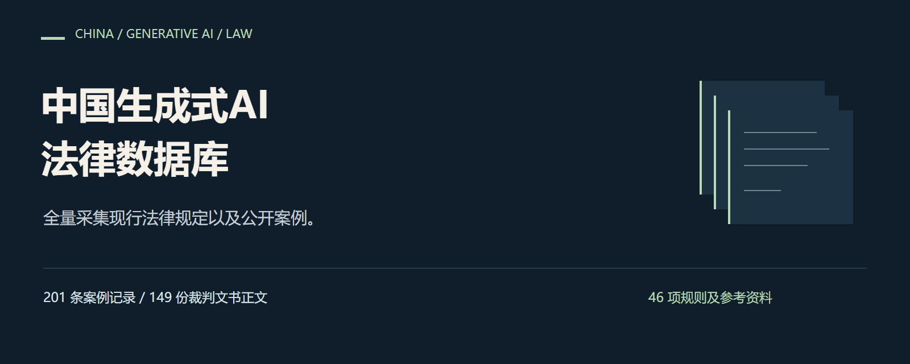

# 中国生成式AI法律数据库

全量采集现行法律规定以及公开案例。

| 内容 | 数量 |
|---|---:|
| 案例记录 | 215 条 |
| 其中：司法记录 | 213 条 |
| 其中：行政执法记录 | 2 条 |
| 裁判文书正文 | 153 份 |
| 无裁判正文、依据官方介绍整理的司法记录 | 60 条 |
| 法规主库 | 26 项 |
| 直接管理参考规范 | 6 项 |
| 标准索引 | 14 项 |

案例记录包括213条司法案件及案件组记录（153条有裁判正文、60条依据官方介绍）和2条行政执法记录。行政执法记录依据官方执法通报，不是人民法院裁判，行政处理文书尚未取得；规则及参考资料共46项。
